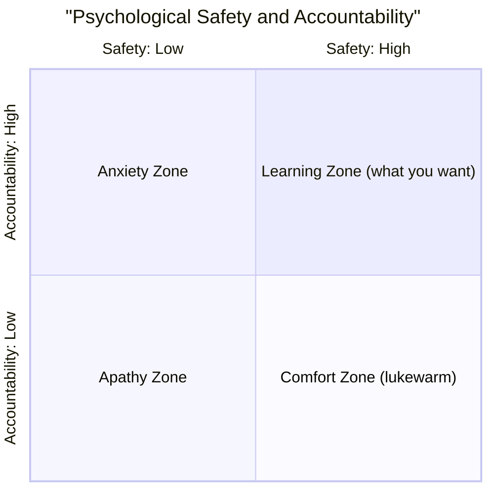

## I was stuck at "yeah, psychological safety is important"

Ask anyone in modern team management what matters most, and you'll hear *"psychological safety."*
I'd been saying the same thing for years — books, training, the Project Aristotle summary from Google's internal research that found safety was the top predictor of team success. I had the vocabulary. I had the rationale.

Then the external gap analysis put it back to me like this:

> You can *talk* about psychological safety.
> But almost no one in the industry can actually **design it into a team** and then **reproduce it in a different team.**
> You're not at that level yet either.

There's not much to say back to a sentence like that.

The gap between *knowing* a thing and *being able to do* it is something engineers separate cleanly when talking about technology. But the moment the subject changed to "people and organizations," I had quietly stopped making that distinction.

## A four-stage model — where are you, actually?

Drawing on Harvard professor Amy C. Edmondson's research (she's the foundational researcher on psychological safety), the maturity of this skill breaks into **four stages**.

| Stage | What you do | Where most people are |
| --- | --- | --- |
| 1. Understand | Know the concept, the research, the definition | Most people stop here |
| 2. Design | Translate it into 1-on-1s, meetings, reviews, evaluation systems | Some get this far |
| 3. Implement | Actually run those systems with a team, so they experience it | Fewer still |
| 4. Reproduce | Create the same level of safety with a different team, different people | Very rare |

"People who know about psychological safety" is a crowded category.
"People who can reproduce it" is much, much smaller.

Here's what I noticed: the people who can reproduce it aren't winning on luck or personal chemistry. They've **written their design and implementation down.**

## Concrete moves, part 1 — Edmondson's four leader behaviors

Edmondson distills it into four leader behaviors. They sound deceptively simple.
But honestly, the number of leaders who consistently do all four, week after week, is small.

### 1. Frame the space

At the top of a meeting, you say something like:

> *"In this meeting we're prioritizing learning over criticism."*
> *"Nobody has the right answer yet, so just say things as they come."*

People don't speak openly unless the space has been declared safe to speak in. And the temperature of a meeting isn't set by the participants — it's set by the leader, in the first 30 seconds.

### 2. Admit your own mistakes first

> *"My judgment on this was off."*
> *"Looking back at the call I made last week, that was a miss."*

In a space where the leader doesn't admit mistakes, no one else will.
This is the front door of "turning failure into learning" — see [Failure Science — life is too short to experience every failure firsthand](/HomePage/en/blog/20260419-failure-science/) for the culture-level argument.
**The first piece of self-disclosure is the leader's job.**

### 3. Actively ask for input

> *"What do you think?"*

But you direct it. To a specific person. Intentionally.

A generic *"any thoughts?"* turns the meeting into a stage for whoever's loudest. *"Tanaka-san, how does this look to you?"* changes the participation structure.

### 4. Build a culture that treats failure as material

Run post-mortems **without blame**. Ask not *"who messed up"* but *"where was the structural hole."*
Once that becomes a habit, the team stops paying the hidden cost of *hiding mistakes*.
A team that doesn't hide is, very simply, faster.

## Concrete moves, part 2 — don't let 1-on-1s decay into status reports

The single highest-leverage tool for implementing psychological safety, both the report and Edmondson's writing argue, is **1-on-1 design.**

If your 1-on-1 has slid into a status update meeting, you've lost most of the value. Here's the agenda I'm working from right now.

```
[An effective 1-on-1, in 25 minutes]

1. Recent life (2 min)
   "Anything outside of work that's been on your mind?"
   Not small talk — locating where their attention actually is

2. Last week's actions (3 min)
   What landed, what didn't

3. Friction and discomfort right now (10 min)
   Repeat every week: "the harder it is to bring up, the more I want it brought up early"

4. Mid-term interests and career (5 min)
   At least once a month, push the conversation into career territory

5. Feedback for me (the leader) (5 min)
   Every single time: "what's one thing I should be doing differently?"
```

The last item is the one that really matters.
By making myself the recipient of feedback every single time, I'm transmitting the safety message **structurally** rather than verbally — "this is a place where you can criticize, including upward."

## Safety without accountability is just lukewarm water

You might read this and think *"got it, build a kind team."* But the report hit me with one more clarification.

> A team that is high on psychological safety but **low on accountability** drifts into the **comfort zone** (lukewarm water).
> A learning organization requires **safety AND accountability together.**

Edmondson's well-known 2×2 lays this out:



Members feel safe enough to speak, **and** they're held to results. Only when both are present does the team keep learning.
Psychological safety isn't "kindness." It's the **foundation that makes learning possible** — and reframing it that way changes how you design for it.

## The simplest path to the "reproduce" stage

Last piece. Here's what I'm actually doing to reach the top of the four-stage model — *reproduce*.

It's plain. **I'm writing my 1-on-1 down on one page.**

- The order of topics, time allocation
- The stock phrases I find myself repeating
- The adjustments I make when something isn't working

Once it's a single document, the next team — different people, different context — can start from the **template**, not from scratch.
"Template" is just another word for reproducibility.

The opposite is also true: until you've written it down, your skill keeps depending on **this place, these people, this day, this mood.** That dependence is the line between leaders who can reproduce and leaders who can't.

## Summary

- Psychological safety maturity has four stages: **understand → design → implement → reproduce.** Most people stop at understand
- Design and implementation start with **Edmondson's four leader behaviors** and a **1-on-1 template**
- Safety alone produces a comfort zone — pair it with **accountability** to reach the **learning zone**
- The on-ramp to *reproduce* is the simplest possible move: **write your method down on one page**

Across the past three days I've written about what I learned from an external gap analysis.
The common thread, in the end, is this: **turning "know" into "can" almost always means unpacking what's already in your head and putting it onto paper.**

In a world where technical level no longer differentiates people much, that — I think — is what engineers should be sharpening next.

## Related Articles

- [The urge to decide fast is your strength's shadow — Need for Cognitive Closure and the 2-week rule](/HomePage/en/blog/20260520-cognitive-closure-and-2-week-rule/) — Three habits for raising the resolution of your own thinking
- [A manager's job is asking, not answering](/HomePage/en/blog/20260509-art-of-asking-questions/) — How to design the questions used inside a 1-on-1
- [Reading Notes on Reinventing Organizations — Why Pyramids Fail and How to Build a Self-Driven Team](/HomePage/en/blog/20260518-teal-organization/) — Delegation as the layer that sits on top of psychological safety
- [A little levity inside seriousness: reading Humor, Seriously](/HomePage/en/blog/20260726-humor-is-the-secret-weapon/) — Why humor can be an entry point into psychological safety
- [Autonomy support runs both ways: reading Why We Do What We Do](/HomePage/en/blog/20260729-power-to-nurture-others/) — Designing a space that supports autonomy
