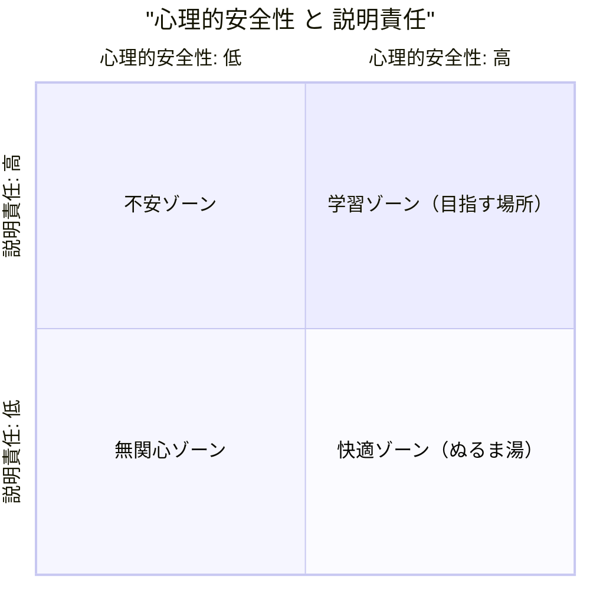

## 「心理的安全性、大事だよね」で止まっていた

「最近のチーム運営で大事なものは？」と聞かれたら、多くの人が「心理的安全性です」と答えると思います。
私自身、いろんな本を読み、いろんな研修を受け、Google のプロジェクト・アリストテレス（チームの成功要因を分析した社内研究）の話を聞いて、ずっとそう答えてきました。

でも、外部からのギャップ分析でこう言われて、ちょっと言葉を失いました。

> あなたは「心理的安全性が大事」と語れます。
> ただし、それを **チームに実装** し、**別のチームでも再現** できる人は、世の中にほとんどいません。
> あなたも、まだその水準にはいません。

ぐうの音も出ない、というのはこういうことです。

知っていることと、できることはまったく違う——技術の世界ではあたりまえに分けて考えるこの区別が、 **「人」と「組織」の話になった途端、自分はすっかり忘れていた** と気づきました。

## 4 段階モデル — 自分が今どこにいるか

ハーバード大学のエイミー・C・エドモンドソン教授（心理的安全性研究の第一人者）の枠組みを参考にしつつ整理すると、心理的安全性の習熟は **4 段階** に分けて考えられます。

| 段階 | やること | 多くの人の現実 |
| --- | --- | --- |
| ① 理解する | 概念・研究・定義を知る | 大体ここで止まる |
| ② 設計する | 1on1・会議・レビュー・評価を仕組みに落とす | 一部の人が辿りつく |
| ③ 実装する | 仕組みを実際にチームで運用し、メンバーに体験させる | さらに少数 |
| ④ 再現する | 異なるチーム・異なるメンバーでも同じ水準を作る | 極めて少数 |

「知っている人」は世の中にあふれています。
でも「再現できる人」になると、ぐっと希少になります。

ここで気づいたのは、 **再現できる人は、運や相性で勝っているのではなく、設計と実装を文書化している** ということでした。

## まず手を動かす ① — エドモンドソンの 4 つの行動

エドモンドソンが整理した、心理的安全性を高めるリーダーの行動は 4 つです。
すごく素直な行動ばかりで、「えっこれだけ？」と思うかもしれません。
でも、これを **毎週意識的に繰り返せている人** は、自分の周りを見渡しても本当に少ないです。

### ① 場を整える

ミーティングの冒頭で、たとえばこう言葉にします。

> 「このミーティングでは、批判より学びを優先します」
> 「いま正解は誰も持っていないので、思いついた段階で言ってください」

「言ってもいい場所だ」と認識されない限り、人は本音を出しません。
場の温度は、参加者がつくるのではなく、 **リーダーが最初の 30 秒で決めている** ものだと感じています。

### ② 自分から率先して失敗を認める

「私の見通しが甘かった」
「先週の判断、結果から見るとミスでした」

リーダーが先に失敗を認めない場所では、メンバーも認めません。
これは [「失敗の科学」— すべての失敗を経験するには、人生は短すぎる](/HomePage/ja/blog/20260419-failure-science/) で書いた「失敗を学びに変える文化」の入口でもあります。
**最初の自己開示はリーダーの仕事です。**

### ③ 発言を積極的に求める

「あなたはどう思う？」
これを **意図的に、特定の人に向けて** 投げかけます。

「何か意見ありますか？」だけだと、声の大きい人だけが話す会議になります。
個別に名指しで「〇〇さんはどう？」と聞くだけで、参加の構造が変わります。

### ④ 失敗を前向きに捉える文化を作る

ポストモーテム（失敗の振り返り）を、 **非難なく** 行う。
「誰が悪かったか」ではなく、「どこに構造的な穴があったか」を問う。
これを習慣化すると、メンバーは「ミスを隠す」コストを払わなくてよくなります。
隠さなくていい組織は、シンプルに早いです。

## まず手を動かす ② — 1on1 を「進捗確認」で終わらせない

心理的安全性の実装で、いちばん効果が高い施策は **1on1 の設計** だと、レポートでもエドモンドソンの本でも繰り返し強調されていました。

ただし、ありがちな「進捗確認会」になっていると、意味は半減します。
私が今、自分用に整理しているアジェンダはこんな感じです。

```
【効果的な 1on1（25 分の例）】

1. 近況（2 分）
　「仕事以外で最近気になっていることある？」
　雑談ではなく、関心の所在を聞く

2. 前回アクションの確認（3 分）
　何ができて、何が難しかったか

3. 今週の困りごと・違和感（10 分）
　「話しにくいことほど早めに出してほしい」を毎回言う

4. 中期的な関心・キャリア（5 分）
　月 1 回はキャリアの話題を必ず入れる

5. 私（リーダー）へのフィードバック（5 分）
　「私が変えた方がいいことはある？」を毎回聞く
```

ポイントは最後の項目です。
**自分自身がフィードバックを毎回受けに行く** ことで、「ここは批判してもいい場所だ」という最大のメッセージを、言葉ではなく構造で伝えています。

## 心理的安全性だけだと、ぬるま湯になる

ここまで読んで「よし、優しいチームを作ろう」と思いそうになりますが、レポートはもう一段だけ釘を刺してきました。

> 心理的安全性だけが高く、説明責任が低い状態は **「ぬるま湯ゾーン」** になりやすい。
> 学習する組織の条件は、 **心理的安全性と説明責任のセット**。

エドモンドソンが示した有名な 2×2 マトリクスがあります。



メンバーが安心して声を上げられて、**その上で結果に責任を持つ**——この両方が揃って初めて、チームは学習し続けられます。
心理的安全性は「優しさ」ではなく、 **「学習を成立させるための土台」** だと位置づけ直すと、設計の方向が見えてきます。

## 「再現する」ためのいちばんシンプルな方法

最後に、4 段階モデルの最上段「再現する」に届くために、私が今やろうとしていることを書いておきます。

シンプルです。 **自分の 1on1 を、1 枚の文書にする** ことです。

- どんな順番で、何を聞くか
- 何分使うか
- 自分が言葉にしている定型フレーズは何か
- うまくいかなかったときの調整パターン

これを文書化しておくと、別のチーム・別のメンバーになっても、 **「型」から始められる** ようになります。
「型」は、再現性のもう一つの名前です。

逆に言えば、文書化していない限り、その腕前は **その場・そのメンバー・その日の気分** に依存し続けます。
そして、その依存こそが、再現できない人と再現できる人を分けています。

## まとめ

- 心理的安全性の習熟は **理解→設計→実装→再現** の 4 段階。多くの人は「理解」で止まる
- 設計と実装は、 **エドモンドソンの 4 行動** と、**1on1 の型** から始められる
- 心理的安全性だけでなく、 **説明責任** とセットにして「学習ゾーン」を目指す
- 「再現」できる人になるための入り口は、 **自分のやり方を 1 枚の文書にする** こと

ここまで 3 回にわたって、ギャップ分析レポートから学んだことを書いてきました。
共通しているのは、 **「知っている」を「できる」に変える作業は、自分の中身を一度ほどいて文書化することだ** という発見でした。

技術力で差がつかなくなったその先で、エンジニアが本当に磨くべきものは、たぶんここにあります。

## 関連記事

- [「早く結論を出したい」は弱みじゃなく、強みの裏返しだった — 認知的閉包欲求と『2週間ルール』](/HomePage/ja/blog/20260520-cognitive-closure-and-2-week-rule/) — 自分の認知の精度を上げる 3 つの習慣
- [マネージャの仕事は「答え」ではなく「問い」だった — 『新 問いかけの作法』が教えるチームづくり](/HomePage/ja/blog/20260509-art-of-asking-questions/) — 1on1 で使える「問い」の設計
- [『ティール組織 入門』読書ノート — ピラミッド型の限界と、自走できるチームの作り方](/HomePage/ja/blog/20260518-teal-organization/) — 心理的安全性の上に乗せる「権限委譲」の話
- [真面目さの中に、少しだけ陽気さを置いてみる — 『ユーモアは最強の武器である』を読んで](/HomePage/ja/blog/20260726-humor-is-the-secret-weapon/) — ユーモアが心理的安全性の入口になるという視点
- [自律性は「与える」ものでもある — 『人を伸ばす力』に学ぶ内発的動機付けの育て方](/HomePage/ja/blog/20260729-power-to-nurture-others/) — 自律性を支える場の設計という視点
